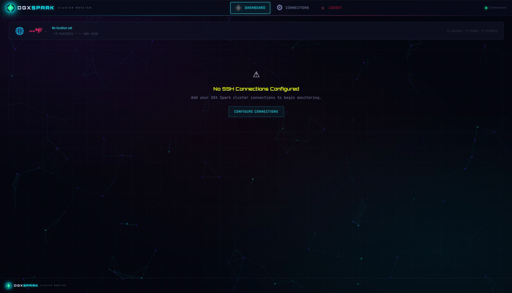
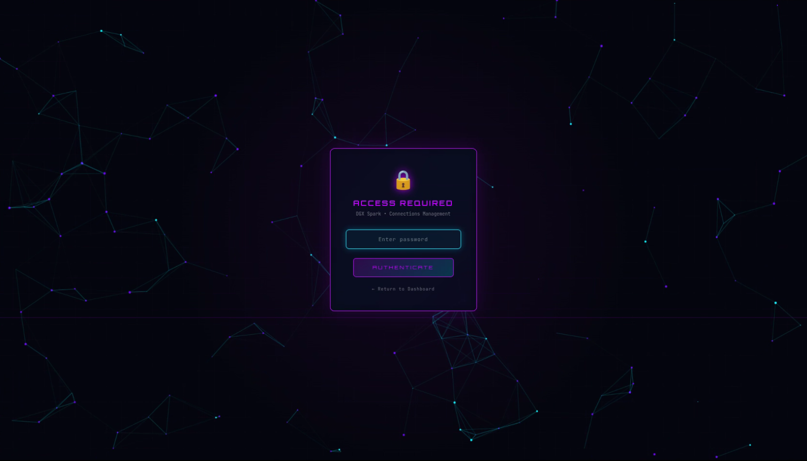
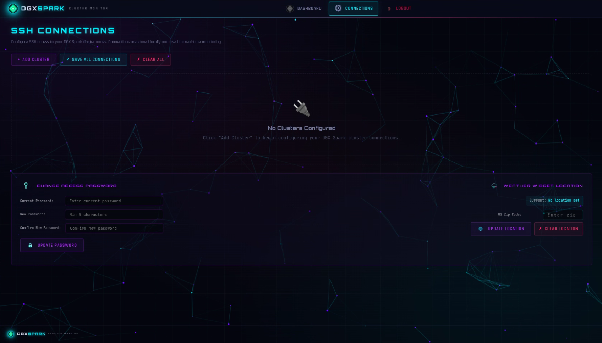
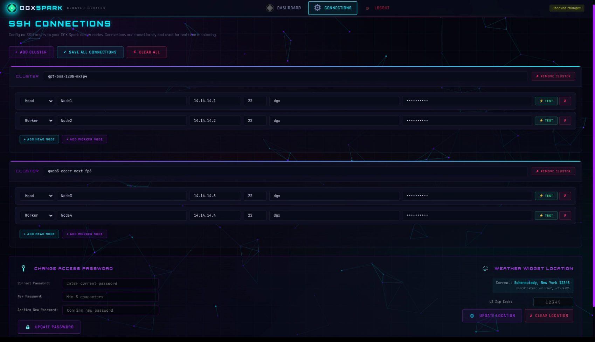
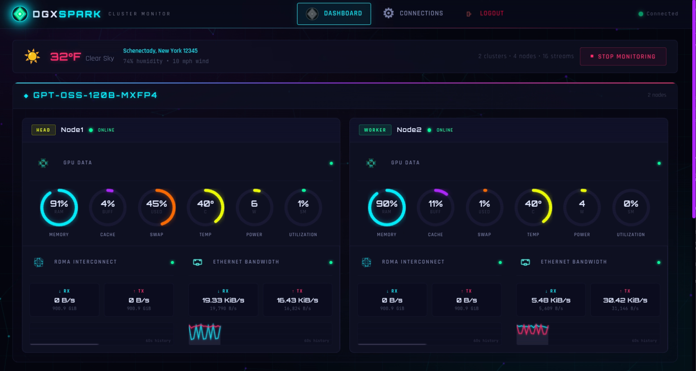
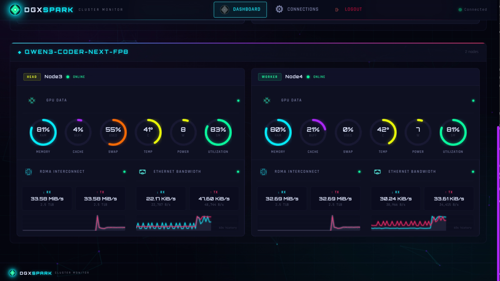
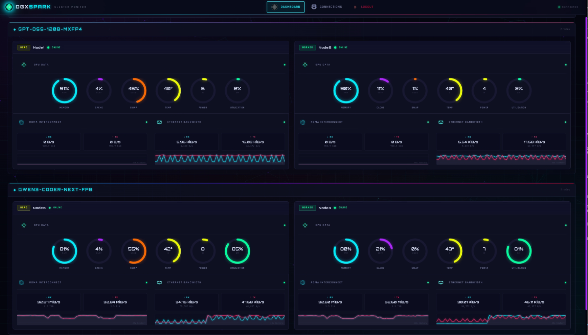
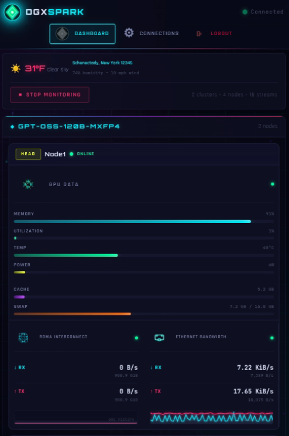
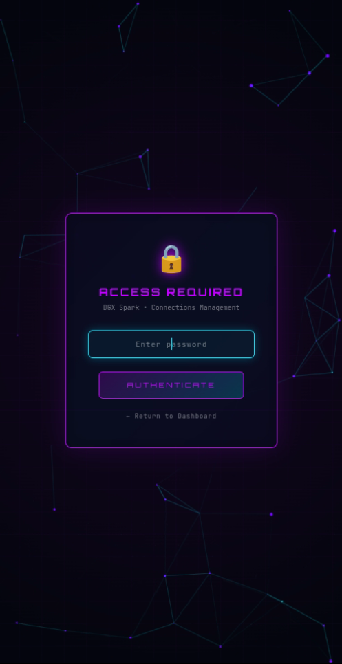
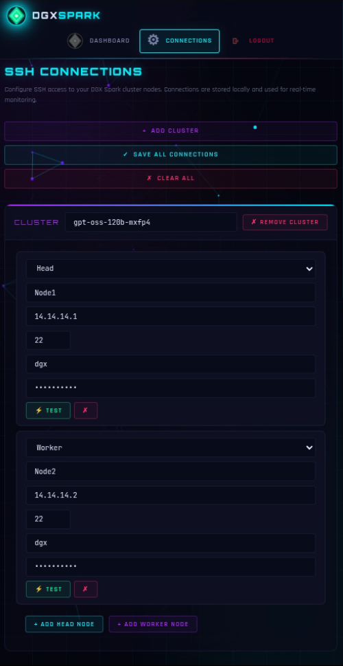

# DGX Spark Cluster Monitor

**A real-time, cyberpunk-themed monitoring dashboard for NVIDIA DGX Spark clusters.**

    

---

## Overview

**This is my very first project!** 🎉

I got my hands on some NVIDIA DGX Spark units and dove headfirst into testing and learning. Along the way, I discovered [spark-arena.com](https://spark-arena.com/) — an incredible resource packed with tools, guides, and references for the DGX Spark ecosystem. It was so useful that it inspired me to contribute something back to the community myself.

While testing with the DGX Spark units, I found the traditional terminal monitoring to feel too antiquated for an AI cluster environment and wanted something that took simple SSH and rendered it into something useful — meet the **DGX Spark Cluster Monitor**.

This is a web-based dashboard that provides live hardware telemetry for NVIDIA DGX Spark GPU clusters. It connects to cluster nodes over SSH and streams real-time metrics including GPU utilization, memory usage, network throughput (RDMA and Ethernet), and thermal data — all rendered in a visually distinctive cyberpunk-inspired interface built with vanilla HTML, CSS, and JavaScript.

---

## Features

### Real-Time Monitoring
- **GPU Metrics** — Utilization percentage, temperature, and power draw via `nvidia-smi`, displayed as animated SVG radial gauges with color-reactive thermal indicators (green → yellow → red)
- **Memory Usage** — Total, used, free, shared, buffer/cache, and available RAM with percentage calculations and visual progress bars
- **RDMA Network** — InfiniBand/RoCE traffic monitoring via `ethtool` statistics with per-second rate calculations and cumulative byte counters
- **Ethernet Bandwidth** — Real-time RX/TX throughput from `/sys/class/net` interface statistics with human-readable formatting (B, KiB, MiB, GiB)
- **Sparkline Charts** — Rolling time-series mini-charts for network metrics rendered on HTML5 Canvas

### Multi-Node Architecture
- Monitor multiple clusters simultaneously, each containing head and worker nodes
- Four concurrent SSH streams per node (memory, RDMA network, Ethernet bandwidth, GPU)
- Independent connection management per cluster with add/remove/test functionality
- Auto-start monitoring on page load with manual START/STOP controls

### Connection Manager
- Password-protected configuration interface
- Add, edit, and remove cluster definitions with named node groups
- Per-node SSH credentials (host, port, username, password)
- One-click connection testing to verify SSH connectivity before monitoring
- Connections stored locally in JSON format

### Weather Widget
- Optional weather display powered by the [Open-Meteo API](https://open-meteo.com/) (free, no API key required)
- Configure by zip code with automatic geocoding via Open-Meteo and OpenStreetMap Nominatim
- Displays current temperature, humidity, wind speed, and weather condition with descriptive icons
- 5-minute auto-refresh cycle
- Gracefully hides when no location is configured

### Security
- Password-based authentication for the connections management interface
- Session management via `express-session`
- Configurable access password with change functionality
- Main monitoring dashboard remains publicly accessible for team visibility

### Design
- **Cyberpunk UI Theme** — Dark interface with neon cyan and pink accents, glowing effects, and scan-line animations
- **Typography** — Orbitron (headings), JetBrains Mono (data/metrics), and Rajdhani (body text) from Google Fonts
- **Animated Background** — Neural network particle animation on HTML5 Canvas
- **Fully Responsive** — Mobile-optimized layouts with collapsible metric panels, touch-friendly controls, and adaptive grid systems
- **No JavaScript Frameworks** — Pure vanilla HTML, CSS, and JavaScript frontend for zero build-step deployment

---

## Screenshots

### Desktop

#### Dashboard — Empty State
The main dashboard before any SSH connections are configured, showing the weather widget placeholder and connection prompt.



#### Access Required — Login
Password-protected access gate for the connections management interface.



#### Connections — Empty State
The SSH connections manager before any clusters are added, with the password and weather location settings panel.



#### Connections — Configured Clusters
Two DGX Spark clusters fully configured with head and worker nodes, ready for monitoring.



#### Live Monitoring — Cluster Overview
Real-time GPU metrics for a cluster with SVG radial gauges showing memory, cache, swap, temperature, power draw, and utilization per node.



#### Live Monitoring — Active Workload
A second cluster under heavy load showing high GPU utilization, active RDMA interconnect traffic, and real-time ethernet bandwidth with sparkline history.



#### Full Dashboard — Multi-Cluster View
Both clusters monitored simultaneously — 4 nodes across 2 clusters with all 16 SSH streams active.



### Mobile

Fully responsive design with breakpoint-aware layouts optimized for phones and tablets.

#### Mobile — Dashboard Monitoring
Linear bar gauges replace radial SVG gauges on smaller screens for optimal readability.



#### Mobile — Login



#### Mobile — Connections



## Tech Stack

| Layer | Technology | Purpose |
|-------|-----------|----------|
| **Backend** | Node.js + Express 5 | REST API and static file serving |
| **Real-Time** | Socket.IO 4.8 | WebSocket-based bidirectional metric streaming |
| **SSH** | ssh2 1.17 | Concurrent SSH sessions to cluster nodes |
| **Auth** | express-session | Session-based access control |
| **Frontend** | Vanilla HTML/CSS/JS | Zero-dependency cyberpunk dashboard |
| **Weather** | Open-Meteo API | Free weather data (no API key) |
| **Geocoding** | Open-Meteo + OpenStreetMap Nominatim | Zip code to coordinates |

---

## Quick Start

### Prerequisites

- **Node.js** 18+ and npm
- SSH access to one or more NVIDIA DGX Spark nodes
- `nvidia-smi` available on target nodes

### Installation

```bash
# Clone the repository
git clone https://github.com/chronosolidus/dgx-spark-dashboard.git
cd dgx-spark-dashboard

# Install dependencies
npm install

# Start the server
npm start
```

The dashboard will be available at `http://localhost:9100`.

### Docker

#### Docker Run

```bash
docker run -d --name dgxsparkmonitor -p 9100:9100 --restart unless-stopped ghcr.io/chronosolidus/dgxsparkmonitor:latest
```

#### Docker Compose

Create a `docker-compose.yml` file:

```yaml
services:
  dgxsparkmonitor:
    image: ghcr.io/chronosolidus/dgxsparkmonitor:latest
    ports:
      - 9100:9100
    restart: unless-stopped
```

Then run:

```bash
docker compose up -d
```

The dashboard will be available at `http://localhost:9100`.

### Configuration

1. Navigate to the **Connections** page (gear icon in the nav bar)
2. Log in with the default password: `spark`
3. Click **Add Cluster** and configure your DGX Spark nodes:
   - **Cluster Name** — A label for the cluster group
   - **Node Name** — Identifier for each node (e.g., "Head Node", "Worker 1")
   - **Node Type** — Head or Worker
   - **Host** — IP address or hostname
   - **Port** — SSH port (default: 22)
   - **Username / Password** — SSH credentials
4. Click **Test Connection** to verify SSH access
5. Save your configuration
6. Return to the Dashboard — monitoring begins automatically

### Changing the Access Password

On the Connections page, use the **Change Access Password** panel to update the default password.

### Weather Widget Setup (Optional)

On the Connections page, enter a US zip code in the **Weather Widget Location** panel and click **Update Location**. The dashboard will display current weather conditions.

---

## Project Structure

```
dgx-spark-dashboard/
├── server.js              # Express + Socket.IO + SSH2 backend
├── package.json           # Node.js dependencies and scripts
├── connections.json       # SSH cluster credentials (auto-generated)
├── passcode.json          # Access password storage
├── weather.json           # Cached weather configuration
└── public/                # Static frontend assets
    ├── index.html         # Main dashboard page
    ├── dashboard.js       # Dashboard logic (gauges, sparklines, metrics)
    ├── connections.html   # Connection manager page
    ├── connections.js     # Connection editor UI logic
    ├── styles.css         # Cyberpunk theme stylesheet
    ├── neural-bg.js       # Animated neural network background
    ├── favicon.svg        # Vector favicon
    └── *.png              # Icon assets (GPU, globe, lock, etc.)
```

---

## Monitored Metrics

| Metric | Source Command | Refresh Rate |
|--------|---------------|-------|
| GPU Utilization, Temp, Power | `nvidia-smi --query-gpu` | 2 seconds |
| Memory (RAM/Swap) | `free -m` | 1 second |
| RDMA Network (InfiniBand) | `ethtool -S` | 1 second |
| Ethernet Bandwidth | `/sys/class/net/*/statistics` | 2 seconds |

Each node opens **4 concurrent SSH streams**, one per metric category. All data is parsed server-side and emitted as structured JSON events via Socket.IO.

---

## API Reference

### REST Endpoints

| Method | Path | Auth | Description |
|--------|------|------|-------------|
| `GET` | `/api/connections` | No | List clusters (passwords masked) |
| `GET` | `/api/connections/raw` | Yes | List clusters (full credentials) |
| `POST` | `/api/connections` | Yes | Save cluster configuration |
| `POST` | `/api/test-connection` | No | Test SSH connectivity to a node |
| `GET` | `/api/weather/config` | No | Get weather location config |
| `POST` | `/api/weather/config` | Yes | Update weather zip code |
| `DELETE` | `/api/weather/config` | Yes | Clear weather location |
| `POST` | `/api/change-passcode` | Yes | Update access password |
| `GET` | `/api/auth/status` | No | Check authentication state |
| `POST` | `/auth/connections` | No | Authenticate with password |

### Socket.IO Events

| Event | Direction | Description |
|-------|-----------|-------------|
| `start-monitoring` | Client → Server | Begin SSH streams for all configured nodes |
| `stop-monitoring` | Client → Server | Terminate all active SSH sessions |
| `parsed-metrics` | Server → Client | Structured metric payload per node |
| `node-status` | Server → Client | Connection state changes (connected/error) |
| `stream-error` | Server → Client | SSH or stream error details |

---

## Environment Variables

| Variable | Default | Description |
|----------|---------|-------------|
| `PORT` | `9100` | Server listening port |

All other configuration is managed through the web interface and stored in local JSON files.


---

## Credits

Built by [**chronosolidus**](https://github.com/chronosolidus)

This project was developed with the assistance of:

- **[Agent Zero](https://github.com/agent0ai/agent-zero)** — Open-source autonomous AI agent framework used for development, debugging, and deployment automation
- **[Claude Opus 4.6](https://www.anthropic.com/claude/opus)** by Anthropic — AI coding assistant used for architecture design, implementation, and code generation

---

## Support

If you find this project useful, consider buying me a coffee! ☕

<a href="https://buymeacoffee.com/chronosolidus">
  
</a>

**Direct link:** [buymeacoffee.com/chronosolidus](https://buymeacoffee.com/chronosolidus)


---

## License

This project is licensed under the [GNU General Public License v3.0](https://www.gnu.org/licenses/gpl-3.0.en.html).
